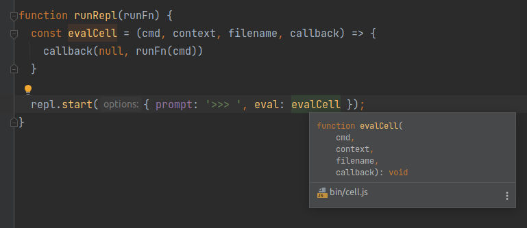

== !

[large]#Evaluator#

== !

[large]#Evaluation Engine#

== !

[large]#Interpreter#

== !

[large]#Code Generator#

== !

[large]#Compiler#

[.notes]
--
Computer science has given up a little bit at this point, so there isn't a canonical name.
--

== !

[large]#Abstract Interpreter#

or (possibly)

[large]#Solver#

[.notes]
--
Unless you think this last step is called an abstract interpreter (which is something quite different from an interpreter), or (possibly even) a solver, in which case we're into deep, deep computer science and that's a whole different talk (which I will be happy to come back and give another time).
--

== !

[large]#Evaluator#

[.notes]
--
Leaving aside what we call it, the evaluator is where the magic happens.

It takes the AST that the parser has produced, and it evaluates it.

Well, what does that mean?

Cell is an interpreted language, so that means our evaluator is going to walk the ASTs, and does what they say! Obviously!
--

== !

[source]
--
total = a + b;
--

[source]
--
[ assignment
  [ symbol, total ]
  [ operation, +
    [ symbol, a ]
    [ symbol, b ]
  ]
]
--

[.notes]
--
Here's one our earlier examples, _total = a + b_, and the AST representation.

Our interpreter is going to start at the top here, and look at the type of the AST node.

It's an _assignment_, so we know there are two little branches of our tree to consider. The first must be a symbol, the name of the variable, and the second is the value we're going to associate with that name.

In fact, that value is an _expression_, so it has to evaluate that first. So it looks at the type of that AST node, which here is an _operation_. An operation's first operands it the actual arithmetic operation to perform, then the next two are the values to operate on.

Again, those values are expressions, so they need to be evaluated. You can see we're recursing down again. In this context, evaluating a symbol means looking up the name to find the value associated with that name.

When we've looked up _a_ and _b_, we can evaluate the plus operation, pass that value back up to the assignment and, finally, pop that value away wherever it is we keep the name/value pairs that make up our stack or heap or whatever.

Easy, right?
--

== !

[source, javascript]
--
include::../../../../jscell/lib/evaluator.js[]
--

[.notes]
--
Here's Cell's evaluator. This is 98 lines, so smaller than the parser, but a just shy of twice as long as the lexer.

You can see recursive nature here, pretty much immediately.

This reads a stream of ASTs, here in the `evaluate` function. Each AST is passes to `eval_expression`, which returns the Cell value which is the result of that expression.

The only thing that's slightly complex is the _function_ call which needs to create a new scope - this is an empty environment with a link back to it's parent - which we can then inject new assignments into. When we look up a symbol, we ask the environment to give us its value. If the environment doesn't have it, it looks in its parent, and so on.

This runtime behaviour is supported by a small library, some of which is "native" code - ie JavaScript that let's you do things the language can't by itself (eg console output), and some of which is actually in Cell. (Most languages have standard libraries a bit like this - magical bits, and bits you could write yourself.

That library code is loaded into the environment at start up.
--

[ditaa, "images/in-the-pink-no-mystery", "svg"]
--

+---------------+         +---------------+         +---------------+
|cGRE           |         | +-----------+ |         | cGRE          |
|               |         | | cPNK      | |         |               |
|               |         | |   lexer   | |         |               |
|               |         | |           | |         |               |
|               |         | +-----------+ |         |               |
|               |         |       |       |         |               |
|               |         |       v       |         |               |
|               |         | +-----------+ |         |               |
|               |         | |cPNK       | |         |               |
|    program    |  ---->  | |  parser   | |  ---->  |    actions    |
|               |         | |           | |         |               |
|               |         | +-----------+ |         |               |
|               |         |       |       |         |               |
|               |         |       v       |         |               |
|               |         | +-----------+ |         |               |
|               |         | |cPNK       | |         |               |
|               |         | | evaluator | |         |               |
|               |         | |           | |         |               |
|            {d}|         | +-----------+ |         |           {io}|
+---------------+         +---------------+         +---------------+

--

[.notes]
--
And that's kind of it.

The Cell interpreter is almost as simple as it could be, but actually interpreters really can be pretty simple.

In practice, of course, they're generally a little more complex.

Obviously, what I've written here is pretty inefficient - everything is done pretty long hand.

* The AST is memory heavy.
* A Cell function calls involve a JavaScript function call, so if we recurse the overhead of Cell's closure capture is inflated by creating a new JavaScript scope too. (Long time programmers, may remember this as something Python used to do too.)
* Almost everything is evaluated at run time.

If, in a fit of hubris, we decided to spent a made fortnight expanding Cell out to be a language suitable for embedding in a webbrowser, how might we make that more efficient?

_There are improvements we could make here, simply by manipulating or annotating the AST.
--

== !

[source]
--
secondsInDay = 60 * 60 * 24;
--

[.notes]
--
Who amongst us has written something like this?

Who hasn't?

Right now, in Cell, this is going to be evaluated at runtime. This takes time, obviously, and space because my AST is bigger. It also means I can't put this value in ROM for my Cell-powered embedded microcontroller
--

== !

[source]
--
secondsInDay = 60 * 60  * 24;
--

[cols="1,1", frame="none", grid="none"]
!===
a|[source]
--
[ assignment
  [ symbol, secondsInDay ]
  [ operation, *
    [ number, 60 ]
    [ operation, *
      [ number, 60 ]
      [ number, 24 ]
    ]
  ]
]
--
|
!===

== !

[source]
--
secondsInDay = 60 * 60  * 24;
--

[cols="1,1", frame="none", grid="none"]
!===
a|[source]
--
[ assignment
  [ symbol, secondsInDay ]
  [ operation, *
    [ number, 60 ]
    [ operation, *
      [ number, 60 ]
      [ number, 24 ]
    ]
  ]
]
--
a|[source]
--
[ assignment
  [ symbol, secondsInDay ]
  [ number, 86400 ]
]
--

!===

[.notes]
--
If we walk the AST looking for operations for which both operands are _numbers_ we can do that bit of arithmetic right there and then, and replace the whole operation node with the result.

This is called constant folding, and it's a very common little optimisation. I implemented this in cell in about half an hour in Tuesday evening.

_*DOWN FOR CODE*_
--

=== !

[source]
--
include::../../../../jscell/bin/astprocessor/constantFolding.js[]
--

=== !

[source]
--
include::../../../../jscell/bin/astprocessor/index.js[]
--

== !

[source]
--
secondsInMinute = 60;
minutesInHour = 60;
hoursInDay = 60;

secondsInDay = secondsInMinute * minutesInHour * hoursInDay;
--

[.notes]
--
What we need here is constant propagation! We should be able to look at our AST and see that, yes, in this expression all these variables are known and are not, in fact, variables at all.

So we can replace them directly with their value, and then we can apply our constant folding.

I didn't write this is in Cell, but if we squiff over to Compiler Explorer ...
--

== !

++++
<iframe src="https://godbolt.org/z/eheoeMGM5" width="1200" height="800"></iframe>
++++

[.notes]
--
int secondsInMinute = 60; +
int minutesInHour = 60; +
int hoursInDay = 24; +
int secondsInDay = secondsInMinute * minutesInHour * hoursInDay;

GCC needs help, but clang is doing lifetime analysis.
Adding const optimises it out completely.

When we're doing that kind of lifetime analysis, we can do other helpful things too ...
--

== !

[.notes]
--
Like type inference.

A lot of languages do some kind of type inferencing - think of _var_ in C#, Kotlin's _val_, C++'s _auto_ and so on. Some languages, like Haskell, can type inference everything.

Here's Webstorm tell me that evalCell is a function taking four parameters, returning void. That's some pretty rich information there - certainly not something that's expressable in JavaScript itself.
--

== !

[large]#Type Checker#

[.notes]
--
There are a number of tools that will statically type check code written in dynamically typed languages, things like Psalm which type checks PHP
--

== !

[large]#Linter#

[.notes]
--
More generally, linters can analyse our AST to do things like tell us about unused variables and that kind of thing.

Some can go further, offering suggestions about expressing yourself better. The Kotlin tooling will often say "here there, this method only has a single line, shall I rewrite it as an expression". If you're using VS Code as your JavaScript editor, it can convert Promise.then chains to use async/await.

They're doing this by matching patterns in the AST. If you can identify the pattern, you can rewrite the code, or issue a warning, or whatever.

Those of you that have used Babel plugins - that's what they're doing.
--

== !

[large]#Bundler#

[.notes]
--
Gather up a load of Javascript files, wham them together, remove the unused bits? The everyday work of Webpack, or Rollup, or whatever right.

These bundlers often make a big deal about their tree-shaking? Any one want to have a stab at how we'd do that?

Make a big list of all the function declarations. Work from our entry point to see which ones are actually called.
--

== !

[large]#Obfuscator#

[.notes]
--
We can easily find the symbol names in the AST right? So we can easily change them to something else! All we need to do is keep track of what we changed the old names to, and it all just drops out.
--

=== !

[source]
--
include::../../../../jscell/examples/bank_account.cell[]
--

[source]
--
acc1 balance=
9.5

acc2 balance=
5.42
--

=== !

[source]
--
include::../../../../jscell/bankaccount.cell.min[]
--

[source]
--
acc1 balance=
9.5

acc2 balance=
5.42
--
